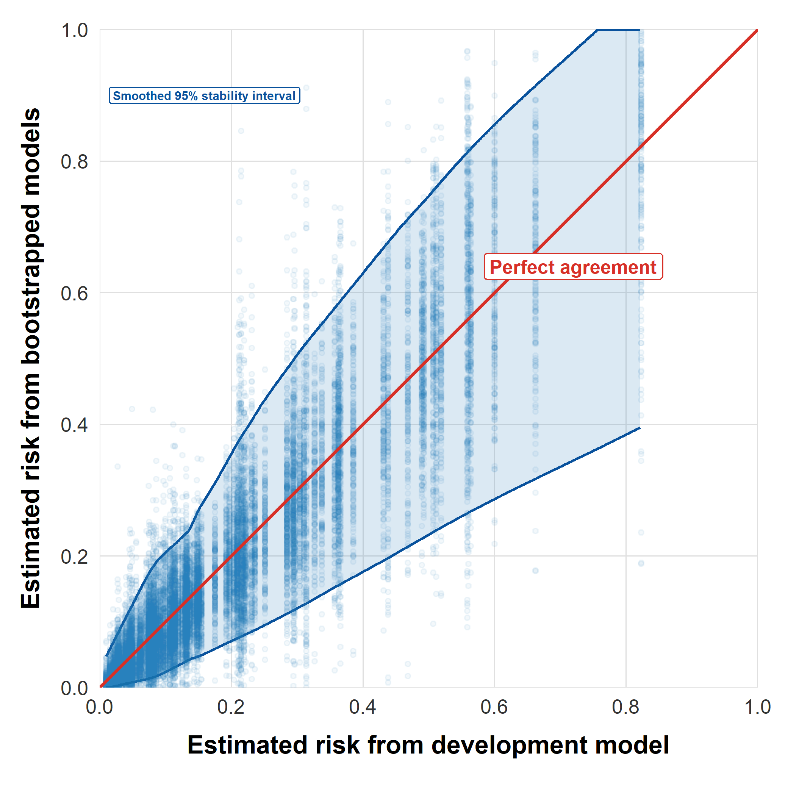
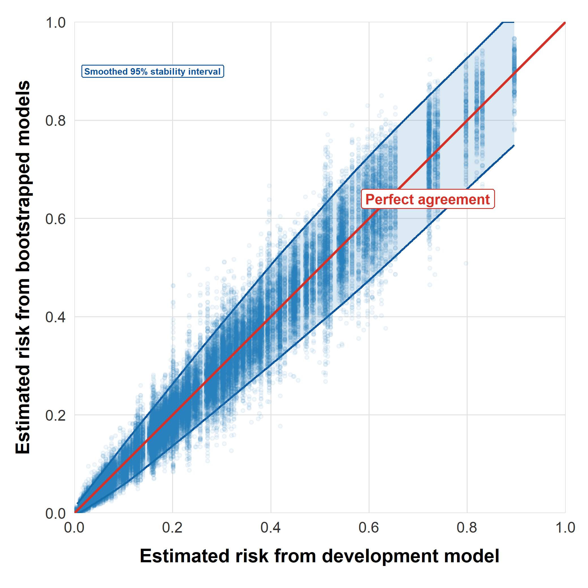
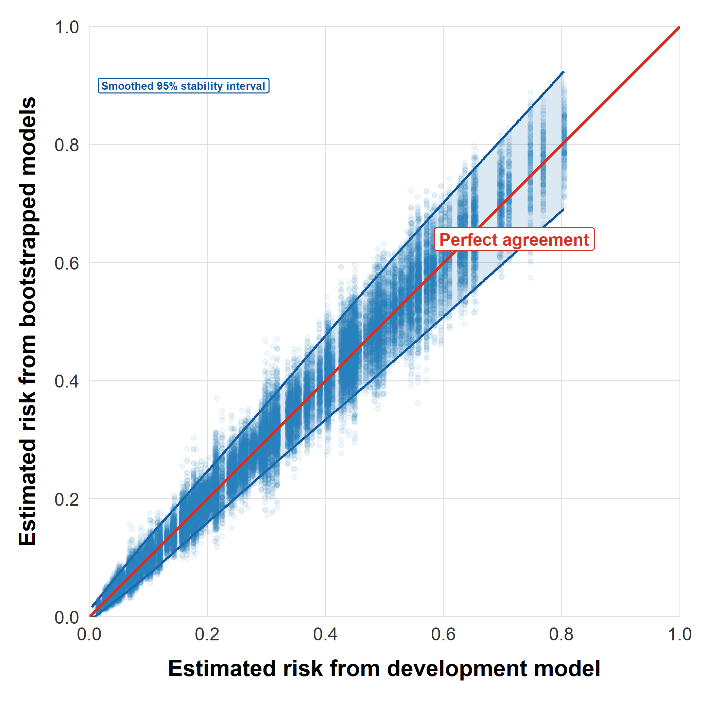
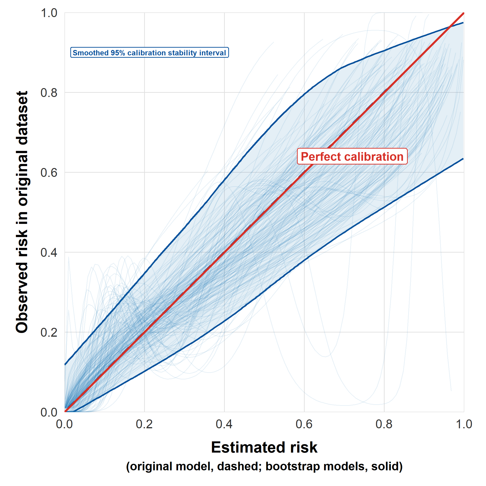
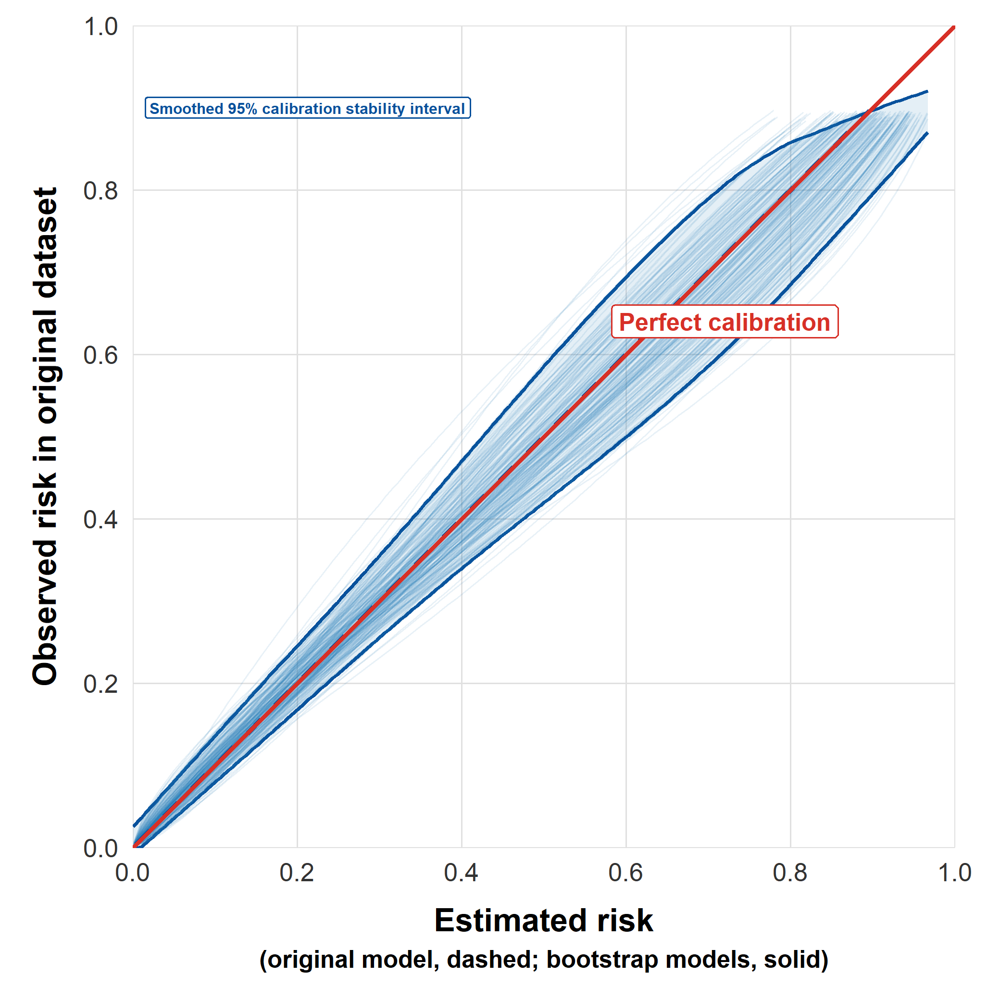
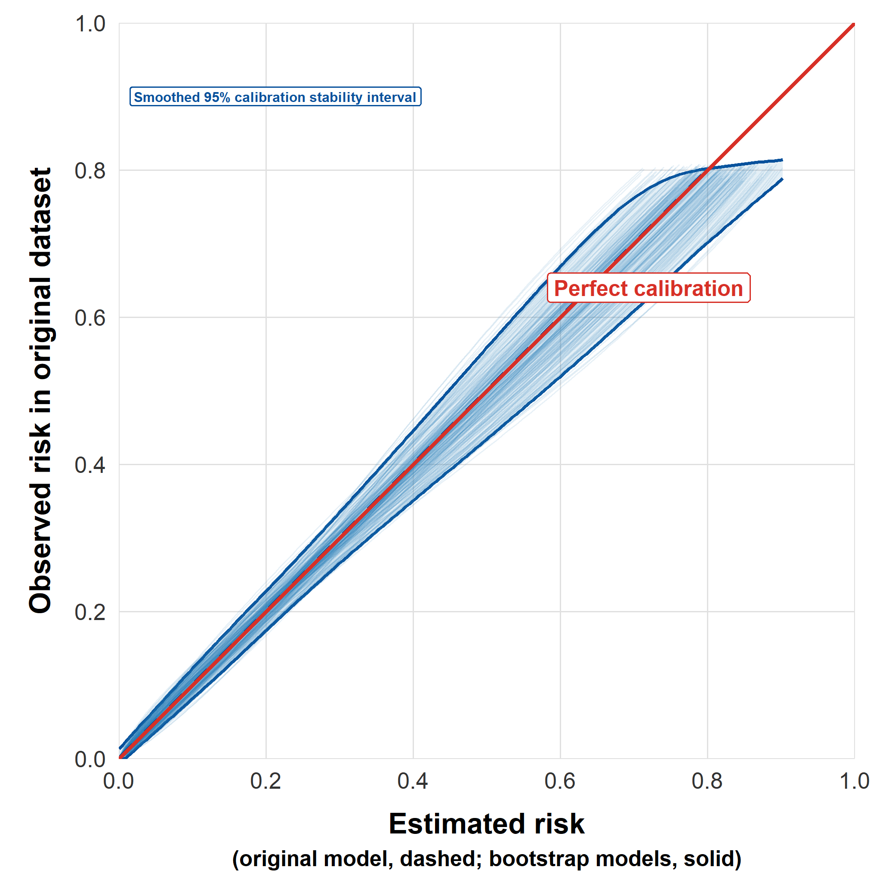
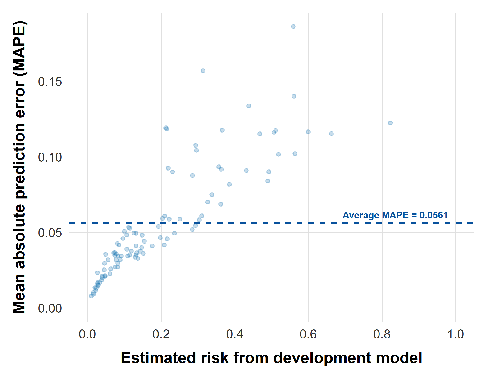
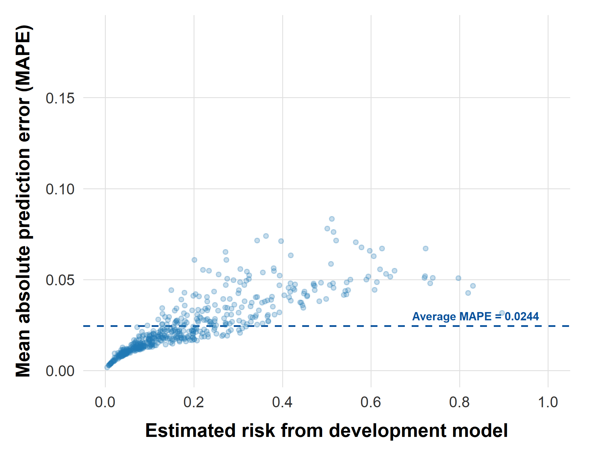
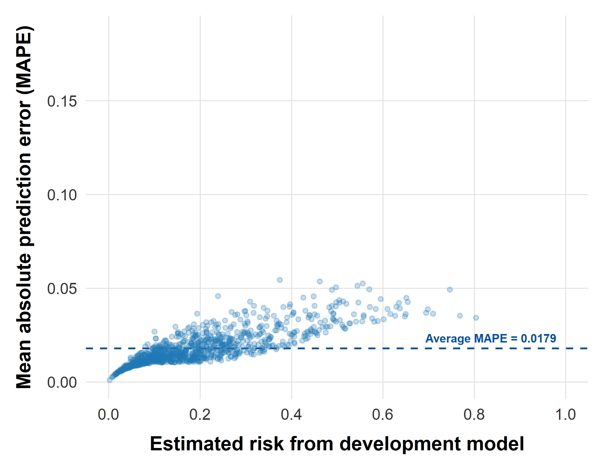

# Background

## Models for disease prediction {auto-animate="true"}

- **Our focus**: logistic regression (**LR**) models

- **Goal**: estimates of predicted risk (probability of an event)

  - [Event]{.highlight}: any binary outcome of interest
  - What is the [probability of the event]{.highlight} occurring in the future?

- **LR** models are common in plant disease epidemiology (*pde)*

- Advantages in forecasting or decision-making

  - Relatively simple

  - Interpretable

  - Explainable (to stakeholders)

::: notes
We focus on LR models, because they are common, useful models in *pde*. 

We assume that the audience has some familiarity with fitting and interpreting LR models, and so will not get into their specifics here.
:::

## Factors impacting model development

::: incremental
- The size of the development dataset

- The proportion of events vs non-events

  - Imbalance is common (events \< non-events)

- Available predictors

  - May be causal, non-causal or proxy

- Signal-to-noise ratio

  - In many biological systems, the signal is low

- Missing data

- The model-building strategy

  - Variable selection, variable representation, interactions, penalization etc.
:::

::: notes
**Imbalance:** we are in most instances trying to predict a rare outcome. These factors all impact model performance, such as the model's accuracy.

**What we mean by proxy:** operational proxy for the true component causes. The true component (LWD) may be difficult to measure or obtain, so we use an operational proxy (RH) which is more readily available and can be used from an operational standpoint.
:::

## Reliability of predictions

Predictions may be unreliable if:

::: incremental
- The development dataset is small

  - Most *pde* datasets *are* small (\<\< 1,000 obs)

- Models are complex relative to the number of events

  - Too many variables or parameters

  - Overfitting (fits the noise in the dataset)

- Low signal-to-noise predictors

  - Common in biological systems
:::

. . .

<!-- You could do it this way manually at each point in the presentation: -->

<!-- Unreliable predictions are indicative of [unstable models]{style="color: #8B1E3F; font-weight: 700;"} -->

<!-- But define the style once in the .scss file, and use the selector: -->

Unreliable predictions are indicative of [unstable models]{.highlight}

::: notes
**The model complexity temptation:** there is the temptation to put as many variables into the model as we have, without thinking of how much data is actually available to estimate the parameters (consider the number of events per predictor parameter). 
:::


## Model instability

::: fragment
#### Sample size

- Instability is a reflection of [insufficient]{.highlight} sample size for model development
:::

:::: fragment
Insufficient sample size leads to instability in ...

<!-- Add some space before the next section header -->

::: {style="height: 1.0em;"}
:::

#### Model development approach

- Instability in the *model specification*

  - Selected predictors, coefficients, degree of penalization ...
    - E.g., would another set of predictors be chosen were the development sample size different?
::::

::: fragment
- Unstable *model specification* ⟶ instability in *predicted risk*
:::

::: fragment
- Instability impacts the [validity]{.highlight} of our models
:::

::: notes
In this talk, we'll focus on the **stability** of predictions. 

We have to recognize the limitations of our datasets, which may be too small for reliably estimating a model.
:::

## Stability of predictions

::: {.fragment .fade-in-then-semi-out}
- [Definition]{.highlight} of instability
:::

::: {.fragment .fade-up}
- [Measurement]{.highlight} of instability
:::

::: {style="height: 14.0em;"}
:::

::: aside
Riley, R. D., & Collins, G. S. (2023). Stability of clinical prediction models developed using statistical or machine learning methods. [Biometrical Journal, 65, 2200302.](https://doi.org/10.1002/bimj.202200302)
:::

::: notes
The concepts we are presenting are based on the paper by Riley & Collins (2023). The reference is listed at the bottom of the slide.

To formally address the stability of LR models, we need to:

  (i) **define** what we mean by instability, and 
  (ii) propose how we intend to **measure** instability.
:::

## Levels of instability {auto-animate="true"}

**Define**: [Four levels]{.highlight} of instability in model predictions:

#### (i) the mean prediction

- The mean prediction given by the model over all the observations
  - A bare minimum requirement

::: aside
Riley, R. D., & Collins, G. S. (2023). Stability of clinical prediction models developed using statistical or machine learning methods. [Biometrical Journal, 65, 2200302.](https://doi.org/10.1002/bimj.202200302)
:::

::: notes
The definitions of the levels of stability move roughly from the global level (e.g., mean) to the individual level (individual probabilities).
:::

## Levels of instability {auto-animate="true"}

#### (ii) the distribution of predictions

- Do two (or more) models have the same, similar or very different distributions in predicted risk, even when developed on the same sample size drawn from the population?
  - This can start to reveal instability at the individual observation level

::: notes
How to assess (we get deeper into this later in the *Assessing model instability* and *Summaries of instability* sections)

- **Calibration curves** of estimated vs observed risk

- **Mean absolute prediction error** (MAPE)

  - mean of the absolute difference between the estimated risks (from the fitted model) and the true risks (from the assumed data generating model)
:::

::: aside
Riley, R. D., & Collins, G. S. (2023). Stability of clinical prediction models developed using statistical or machine learning methods. [Biometrical Journal, 65, 2200302.](https://doi.org/10.1002/bimj.202200302)

Van Calster et al. (2016). A calibration hierarchy for risk models was defined: from utopia to empirical data. [Journal of Clinical Epidemiology, 74:167-176.](https://doi.org/10.1016/j.jclinepi.2015.12.005)
:::

## Levels of instability {auto-animate="true"}

#### (iii) predictions in subgroups

- Subgroups defined by a particular covariate (it does not have to be part of the model)

  - E.g., the subset of observations for which the condition `mean(RH) < 70%` holds for the predictor `mean(RH)`
  
::: notes
How to assess:

- Distribution of the mean predicted probabilities in this subset of observations for models fit to different (bootstrap) versions of the development dataset

- Is there large variability in the predictions?

  - Any two models $M_{b1}$ and $M_{b2}$ may differ considerably in their estimated risks for the subgroup ⟹ instability
:::

::: aside
Riley, R. D., & Collins, G. S. (2023). Stability of clinical prediction models developed using statistical or machine learning methods. [Biometrical Journal, 65, 2200302.](https://doi.org/10.1002/bimj.202200302)
:::


<!-- Option 1 for this slide -->

## Levels of instability {auto-animate="true"}

#### (iv) predictions for individuals

- Individual = plot, field, etc.

- Different example models (built on similar versions of the development dataset) should give similar estimated risks for a given individual

  - If the estimates vary a lot ⟹ instability at the *individual* level

::: notes
How to assess:  (more details in the *Assessing model instability* and *Summaries of instability* sections)

- Vary the input development dataset (keep sample size the same)

  - Fit the same model to each dataset

- What do the different models predict for a given *individual* observation?
:::

::: aside
Riley, R. D., & Collins, G. S. (2023). Stability of clinical prediction models developed using statistical or machine learning methods. [Biometrical Journal, 65, 2200302.](https://doi.org/10.1002/bimj.202200302)
:::

<!-- Option 2 for this slide: varying width columns -->

<!-- ## Levels of instability {auto-animate="true"} -->

<!-- :::::: columns -->

<!-- ::: {.column width="60%"} -->

<!-- #### (iv) predictions for individuals (field, plot) -->

<!-- - Different example models (built on similar versions of the development dataset) should give similar estimated risks for a given individual -->

<!--   - If the estimates vary a lot ⟹ instability at the *individual* level -->

<!-- ::: -->

<!-- :::: {.column width="40%"} -->

<!-- ::: fragment -->

<!-- ##### How to assess: -->

<!-- - Vary the input development dataset (keep sample size the same) -->

<!--   - Fit the same model to each dataset -->

<!-- - What do the different models predict for a given *individual* observation? -->

<!-- ::: -->

<!-- :::: -->

<!-- :::::: -->

<!-- ::: aside -->

<!-- Riley, R. D., & Collins, G. S. (2023). Stability of clinical prediction models developed using statistical or machine learning methods. [Biometrical Journal, 65, 2200302.](https://doi.org/10.1002/bimj.202200302) -->

<!-- ::: -->

<!-- Option 3 for this slide: tabs -->

<!-- ## Levels of instability {auto-animate="true"} -->

<!-- ::: panel-tabset -->

<!-- ### (iv) predictions for individuals (field, plot) -->

<!-- - Different example models (built on similar versions of the development dataset) should give similar estimated risks for a given individual -->

<!--   - If the estimates vary a lot ⟹ instability at the *individual* level -->

<!-- ### How to assess -->

<!-- - Vary the input development dataset (keep sample size the same) -->

<!--   - Fit the same model to each dataset -->

<!-- - What do the different models predict for a given *individual* observation? -->

<!-- ::: -->

<!-- ::: aside -->

<!-- Riley, R. D., & Collins, G. S. (2023). Stability of clinical prediction models developed using statistical or machine learning methods. [Biometrical Journal, 65, 2200302.](https://doi.org/10.1002/bimj.202200302) -->

<!-- ::: -->

# Assessing model instability

## Bootstrap assessment of instability {auto-animate="true"}

- Stability is assessed by comparing the estimated risks to the true risks.

  - But we don't know the actual data generating process ⟹ true risk is unknown

- Examine instability in a different way: via [bootstrapping]{.highlight} of the development data

::: notes
When developing a model, we do not know the true risk of an individual. 

Therefore, we need to examine instability in a different way, using the development data itself. 

The method for doing that is based on the bootstrap. 

Why the bootstrap? Because it is a technique built to examine sampling variability, so fits perfectly into how variability in the development dataset affects model development and performance.
:::

## Bootstrap assessment of instability {auto-animate="true"}

#### Algorithm

1.  Fit the model ($M_o$) on the (original) development dataset ($N$ obs)

2.  Use $M_o$ to make predictions $\hat{p}_i$ for each obs in $N$ $(i = 1, ..., N)$ in the development dataset

3.  Generate a bootstrap sample ($b$), with replacement, of size $N$

4.  Using $b$, develop a bootstrap model ($M_b$), using the same model development process as used for the original model $M_o$

5.  Use the bootstrap model $M_b$ to make predictions ($\hat{p}_{b,i}$) for each individual $i$ in the *original* data set

6.  Repeat steps 3 to 5 many times (at least 200); $b = 1, ..., B$

7.  Store the $B$ predictions, as well as the original prediction for each individual $i$

::: notes
May want to skip this slide, instead of going through it; or just point out that it is a simple algorithm without going over the details. 

The point is, it is a relatively simple algorithm. 

$M_o$ means the model (M) fit on the original (o) development dataset.
:::

# Illustration of instability

::: notes
We'll use a simulated dataset to illustrate instability in model development?

Why a simulated dataset? Because we can use this as a `ground truth` and specify the population structure.

The structure will be described in the next slide.
:::

## Simulated dataset {auto-animate="true"}

- A [population]{.highlight} of 200,000 individuals
- Three predictors:
  - $x_1$ and $x_2$ are causal; $x_3$ is a pure noise variable
    - $x_3$ included deliberately as an irrelevant predictor
- $x_1$ and $x_2$ aren't equally important
  - $\beta_1 \approx 2\beta_2$
  - ⟹ $x_1$ contributes roughly 4× the signal variance of $x_2$ (an 80%/20% split)
- Outcome prevalence of 20% events
- A moderate signal-to-noise ratio (SNR = 8) ⟹ a population AUC of ≅0.75
- Draw two random ([model development samples]{.highlight}) of 100 and 500 observations from the population

::: notes
x1's coefficient is twice x2's, so x1 contributes 4x the *variance* of x2 (since variance scales with beta\^2). 

x3 is unrelated to the outcome.
:::

## Simulated dataset {auto-animate="true"}

<!-- Load the data -->

```{r}
#| label: connect-to-database
#| include: false
library(DBI)
library(duckdb)
library(dplyr)

con <- dbConnect(duckdb(), dbdir = "data/sim_data.duckdb", read_only = TRUE)
x <- tbl(con, "dat_unequal") |> collect()
# Do NOT disconnect here, as in later chunks we will still be connecting to this DB
# dbDisconnect(con, shutdown = TRUE)
```

```{r}
#| label: population-summary-stats
#| echo: false
library(gt)

# `x` (dat_unequal) already carries the true data-generating coefficients as
# constant columns (beta1, beta2), written by simulate_snr_dataset_unequal()
# in data_simulation.qmd -- so the contribution ratio and variance shares
# below are computed directly from the actual simulated object, not
# re-derived from the design targets.
beta1 <- x$beta1[1]
beta2 <- x$beta2[1]

var_x1_contrib <- var(beta1 * x$x1)
var_x2_contrib <- var(beta2 * x$x2)
share_x1 <- var_x1_contrib / (var_x1_contrib + var_x2_contrib)
share_x2 <- 1 - share_x1

# Discrimination (c-statistic) is refit here directly on the population,
# using only the two genuine predictors (matching the data-generating model),
# rather than assumed from the design target -- this is the achieved AUC for
# THIS specific simulated population.
fit_pop <- glm(y ~ x1 + x2, data = x, family = binomial())
pred_pop <- predict(fit_pop, type = "response")
auc_pop <- as.numeric(pROC::auc(pROC::roc(x$y, pred_pop, quiet = TRUE)))

pop_summary <- tibble::tibble(
  Property = c(
    "Population size (N)",
    "Predictors",
    "x1 : x2 contribution ratio",
    "Share of signal variance \u2013 x1",
    "Share of signal variance \u2013 x2",
    "Target event prevalence",
    "Empirical event prevalence",
    "Target signal-to-noise ratio (SNR)",
    "Discrimination (AUC)"
  ),
  Value = c(
    format(nrow(x), big.mark = ","),
    "x1, x2 causal; x3 noise (unrelated to y)",
    sprintf("%.1f : 1", beta1 / beta2),
    sprintf("%.1f%%", share_x1 * 100),
    sprintf("%.1f%%", share_x2 * 100),
    "20%",
    sprintf("%.1f%%", mean(x$y) * 100),
    "8 (moderate signal)",
    sprintf("%.2f", auc_pop)
  )
)

# Same styling convention as the "Average MAPE by Development Sample Size"
# table: bold column labels, blue top/bottom borders, larger fonts so the
# table reads clearly once shrunk down onto a revealjs slide (gt's defaults
# render noticeably small in that context).
pop_gt <- pop_summary |>
  gt::gt() |>
  gt::tab_header(
    title = "Simulated Population Characteristics",
    subtitle = sprintf(
      "Source population (N = %s) for the N = 100 and N = 500 development samples",
      format(nrow(x), big.mark = ",")
    )
  ) |>
  gt::cols_label(
    Property = "Property",
    Value    = "Value"
  ) |>
  gt::cols_align(align = "left", columns = Property) |>
  gt::cols_align(align = "center", columns = Value) |>
  # Light blue fill on the Property column (same "#DEEBF7" tone used in the
  # MAPE table's gradient) gives visual separation between label and value
  # without needing a numeric color gradient, which wouldn't make sense here
  # since Value mixes counts, percentages, and ratios.
  gt::tab_style(
    style = list(gt::cell_text(weight = "bold"), gt::cell_fill(color = "#DEEBF7")),
    locations = gt::cells_body(columns = Property)
  ) |>
  gt::tab_style(
    style = gt::cell_text(weight = "bold"),
    locations = gt::cells_column_labels(columns = everything())
  ) |>
  gt::tab_source_note(
    source_note = gt::md("*x3 is included as a pure noise variable, to test how model-building handles an irrelevant predictor under instability.*")
  ) |>
  gt::tab_options(
    table.font.size             = gt::px(22),
    heading.title.font.size     = gt::px(24),
    heading.subtitle.font.size  = gt::px(15),
    column_labels.font.size     = gt::px(18),
    table.border.top.color      = "#08519C",
    table.border.top.width      = gt::px(3),
    table.border.bottom.color   = "#08519C",
    table.border.bottom.width   = gt::px(3),
    heading.border.bottom.color = "#08519C",
    source_notes.font.size      = gt::px(13),
    data_row.padding            = gt::px(10)
  )

pop_gt

# If you want to save the table:
# gt::gtsave(
#   pop_gt,
#   filename = here::here("images", "population_summary_table.png")
# )
```

::: notes
There are two `Simulated Dataset` slides.

The first (on the previous slide) presents the characteristics of the simulated dataset in bullet form. 

The second (this slide) presents the characteristics in a Table.
:::

## Build the model

- $logit(y) = x_1 + x_2 + x_3$

- Development datasets:

  - $N = 100$

  ```{r}
  #| echo: true
  #| eval: false
  #| code-line-numbers: false
  mod_100 <- glm(y ~ x1 + x2 + x3, data = dat_100, family = binomial())
  ```

  - $N = 500$

  ```{r}
  #| echo: true
  #| eval: false
  #| code-line-numbers: false
  mod_500 <- glm(y ~ x1 + x2 + x3, data = dat_500, family = binomial())
  ```
  
  - $N = 1,000$

  ```{r}
  #| echo: true
  #| eval: false
  #| code-line-numbers: false
  mod_1000 <- glm(y ~ x1 + x2 + x3, data = dat_1000, family = binomial())
  ```

::: notes
Just showing the code for the model fitting. It's a simple model.

QUESTION THAT MAY ARISE: Why not repeatedly resample from the population of 200,000? That could be done, if we were examining instability by comparing estimated risks to true risks for each individual, where true risk was represented by this population.

However, in practice when developing a model, the “true” risk of each individual is unknown, and so need to examine instability in a different way, using the development data itself.
:::

## Summaries of instability {auto-animate="true"}

#### Prediction instability plot

- A scatter plot of the $B$ predicted values for each individual $i$ against the original predicted value

::: panel-tabset
### 100 obs

{width="60%" fig-align="center"}

### 500 obs

{width="60%" fig-align="center"}

### 1,000 obs

{width="60%" fig-align="center"}
:::

::: notes
Interpretation: For each individual, we have:

  (i) the estimated risk from the original development model
  (ii) the estimated risk from 200 bootstrap models. 
  
If there is perfect agreement between the original estimated risk and the bootstrap estimated risks, then the points should all fall on the **red line**. But, for any given original individual risk estimate, there is a range (scatter of associated bootstrap-estimated risks)! 

The solid **blue lines** delineate the boundaries for a 95% smoothed stability interval (region in which central 95% of the bootstrapped risk estimates fall). 

What does this say about the reliability of individual risk estimates? 

In the small development sample size setting, it is unlikely that this model will be reliable in the target population. Notice the instability increases with the estimated risk.
:::

## Summaries of instability {auto-animate="true"}

#### What is model calibration?

- If the model says "20% risk," do about 20% of those individuals *actually* experience the event?

  - Are the predicted probabilities themselves are trustworthy numbers

- Calibration [complements]{.highlight} discrimination (e.g., AUC)

  - A model can have excellent discrimination (high AUC) while still being badly calibrated — e.g., consistently predicting 40% risk for people whose true risk is 15%.

::: aside
Van Calster et al. (2019). Calibration: the Achilles heel of predictive analytics. [BMC Med 17, 230](https://doi.org/10.1186/s12916-019-1466-7)

Shah et al. (2025). Safer and Smarter: Leveraging interpretation-guided modeling and data merging of disease and environmental data for plant disease risk prediction. [Phytopathology 115:1329-1343](https://doi.org/10.1094/PHYTO-01-25-0008-FI)
:::

::: notes
As calibration will not be familiar to the majority of the audience, this slide provides a brief description of the concept. 

We won't get into the details of constructing a **calibration curve** (there is no time), but you can find the details in the Van Calster et al. paper listed at the bottom of the slide, as well as a practical plant pathology example in the Shah et al. paper.
:::

## Summaries of instability {auto-animate="true"}

#### Calibration instability plot

- For logistic regression, calibration is almost always near-perfect with the development dataset

- Instability is revealed by plotting the calibration curves for the bootstrap model $M_b$ applied to the original data

  - Wide spread of the calibration curves ⟹ instability

::: panel-tabset
### 100 obs

{width="60%" fig-align="center"}

### 500 obs

{width="60%" fig-align="center"}

### 1000 obs

{width="60%" fig-align="center"}
:::

::: notes
**Red** line: perfect calibration. 

**Black** line: represents the calibration of the fitted model on the development dataset. But as we mentioned, calibration is almost always near-perfect in the development dataset, and so the black line is actually almost indistinguishable from the red line. 

**Pale blue** lines: the calibration curves for the individual bootstrap models.

**Thicker blue**  lines: the 95% intervals for the individual bootstrap calibration curves. Instability seen with model development sample size of 100. And has been reduced with the larger sample sizes.

**Question that may come up**: it appears the upper range of estimated risk is higher in the 500 obs sample than in the 1,000 obs sample. That is indeed true with these samples. In the 500 obs sample, the max fitted probability was 0.896. For the 1,000 obs sample it was 0.804.
:::

## Summaries of instability {auto-animate="true"}

#### Mean absolute prediction error (MAPE)

- MAPE for individual $i$ = $\frac{\sum_{b=1}^{B}|\hat{p_{bi}}-\hat{p_i}|}{B}$

- average MAPE across all individuals = $\frac{\sum_{b=1}^{B}\sum_{i=1}^{N}|\hat{p_{bi}}-\hat{p_i}|}{BN}$

::: fragment
```{r}
#| label: mape-summary-table
#| echo: false
# con <- dbConnect(duckdb(), dbdir = "data/sim_data.duckdb", read_only = TRUE)
mape_summary <- tbl(con, "mape_summary") |> collect()
dbDisconnect(con, shutdown = TRUE)
rm(con)

# Polished gt table for the revealjs slide. gt renders to plain HTML, so it
# displays natively in revealjs without any extra conversion step.

# Percent reduction in average MAPE going from the smaller to larger
# development sample -- computed dynamically so the wording in the source
# note always matches whatever is in mape_summary, even if you change B,
# seeds, or the sample sizes later.
pct_reduction <- (mape_summary$average_mape[1] - mape_summary$average_mape[2]) /
  mape_summary$average_mape[1] * 100

mape_gt <- 
  mape_summary |>
  dplyr::mutate(development_n = as.integer(development_n)) |>
  gt::gt() |>
  gt::tab_header(
    title = "Average MAPE by Development Sample Size",
    subtitle = "Mean absolute difference between original and bootstrap model predictions"
  ) |>
  gt::cols_label(
    development_n = "Development N",
    average_mape   = "Average MAPE"
  ) |>
  gt::fmt_integer(columns = development_n) |>
  gt::fmt_number(columns = average_mape, decimals = 4) |>
  gt::cols_align(align = "center", columns = everything()) |>
  gt::data_color(
  columns = average_mape,
  fn = scales::col_numeric(
    palette = c("#DEEBF7", "#6BAED6", "#08519C"),
    domain  = range(mape_summary$average_mape)
  )
  ) |>
  gt::tab_style(
    style = gt::cell_text(weight = "bold"),
    locations = gt::cells_column_labels(columns = everything())
  ) |>
  gt::tab_source_note(
    source_note = gt::md(sprintf(
      "*Average MAPE fell by %.0f%% from N = %d to N = %d.*",
      pct_reduction, mape_summary$development_n[1], mape_summary$development_n[2]
    ))
  ) |>
  gt::tab_options(
    table.font.size          = gt::px(22),
    heading.title.font.size  = gt::px(24),
    heading.subtitle.font.size = gt::px(15),
    column_labels.font.size  = gt::px(18),
    table.border.top.color   = "#08519C",
    table.border.top.width   = gt::px(3),
    table.border.bottom.color = "#08519C",
    table.border.bottom.width = gt::px(3),
    heading.border.bottom.color = "#08519C",
    source_notes.font.size   = gt::px(13),
    data_row.padding         = gt::px(10)
  )

mape_gt
```
:::

```{r}
#| label: save-mape-table
#| eval: false
#| include: false
# gt::gtsave() can export the table directly as a standalone PNG, useful if
# you want to drop it into a slide as an image rather than rendering the
# live gt HTML widget inside the revealjs deck.
gt::gtsave(
  mape_gt,
  filename = here::here("images", "mape_summary_table.png")
)
```

::: fragment
- Always use in conjunction with a [MAPE instability plot]{.highlight}
:::

::: notes
**Recall:** MAPE = mean absolute difference between the bootstrap model predictions and the original model prediction.

**Assumption:** Estimating what the error would be assuming we knew the truth. 

**Caveat:** Average MAPE, though useful as a **single summary**, may mask instability in particular regions at the individual level -- hence why it should be used in conjunction with a MAPE instability plot.
:::

## Summaries of instability {auto-animate="true"}

#### MAPE instability plot

- a scatterplot of the MAPE value (*y*-axis) for each individual against the estimated risk from the original prediction model (*x*-axis)

::: panel-tabset
### 100 obs

{width="60%" fig-align="center"}

### 500 obs

{width="60%" fig-align="center"}

### 1000 obs

{width="60%" fig-align="center"}
:::

::: notes
**MAPE plot:** reveals the full range of the MAPE values. Helps you identify where instability may be of the most concern with the predicted values. 

In our example, we see that **MAPE** increases as estimated risk increases; also, the **variability** increases, especially around p = 0.5. 

There is higher model instability in estimating higher risks. And this is true regardless of the sample size (100,  500 or 1,000), though the instability is less with the higher model development sample sizes.
:::

## Not covered

- Stability in sub-groups:

  - Sample size in some subgroups may be smaller, increasing possibility of instability e.g., resistance classes, locations, production scenarios (organic *vs* conventional)

- Instability concepts apply to other more complex (ML/AI) model algorithms.

- Extension to other targets:

  - Utility, net benefit, assurance probabilities

- Other stability measures:

  - Classification stability
  - Decision curve (net benefit) stability

::: aside
McRoberts et al. (2011). Perceptions of disease risk: From social construction of subjective judgments to rational decision making. [Phytopathology 101:654-665](https://doi.org/10.1094/PHYTO-04-10-0126).

Riley et al. (2023). Clinical prediction models and the multiverse of madness. [BMC Med 21, 502](https://bmcmedicine.biomedcentral.com/articles/10.1186/s12916-023-03212-y).

<!-- Chekroud et al. (2024). Illusory generalizability of clinical prediction models. [Science 383:164-167](https://www.science.org/doi/10.1126/science.adg8538). -->
:::

::: notes
We have only considered model development and **internal validation** of simple logistic regression models.

Although we have focused on logistic regression, the concepts apply to other algorithms, e.g., random forests, SVMs and so on.

We simply list some other targets (utility, net benefit assurance probabilities) - beyond mean or individual predicted probabilities - for stability assessment. We don't get into their details here, which would take too much time.

If the end goal is to produce a classification (e.g., assigning a field to a low or high risk group), then may want to look at a classification instability plot.

The same concerns extend to the validation of a model in an external dataset. How large should an **external validation** dataset be?
:::

# Thank You {background-image="images/barcelona.jpg" background-size="cover" background-opacity="0.3"}
